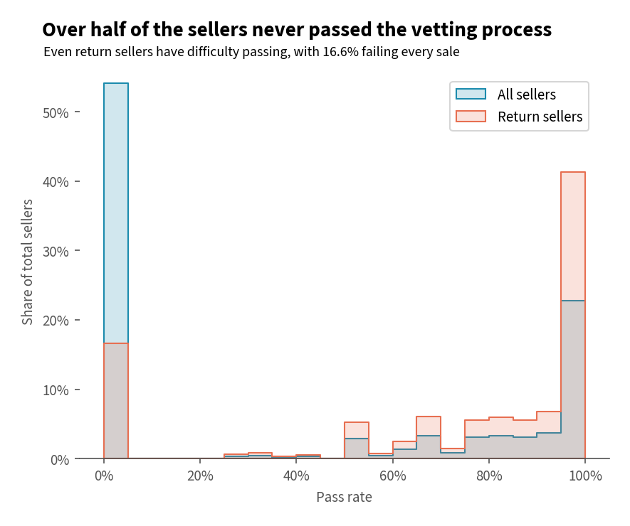
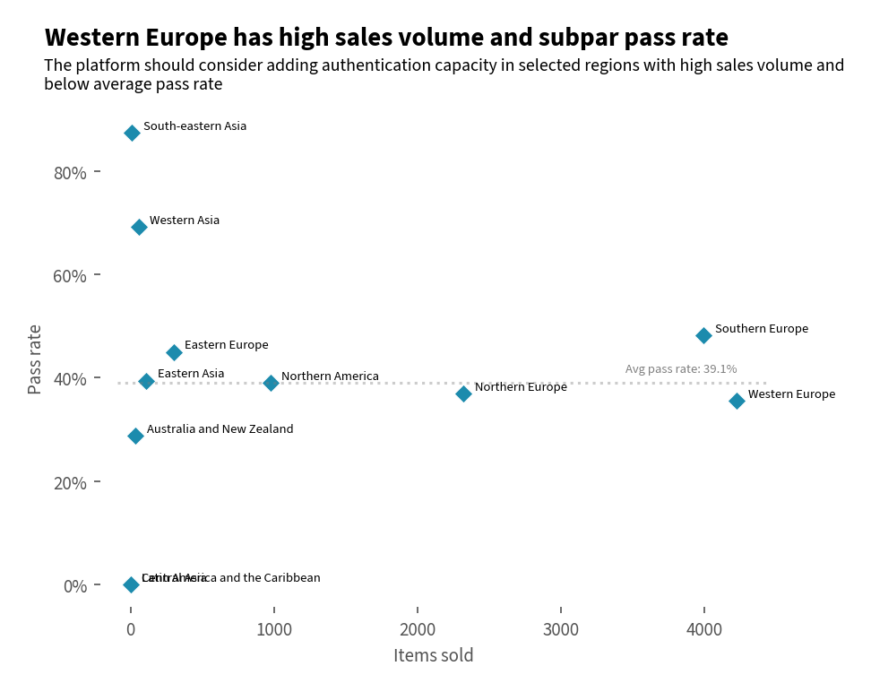
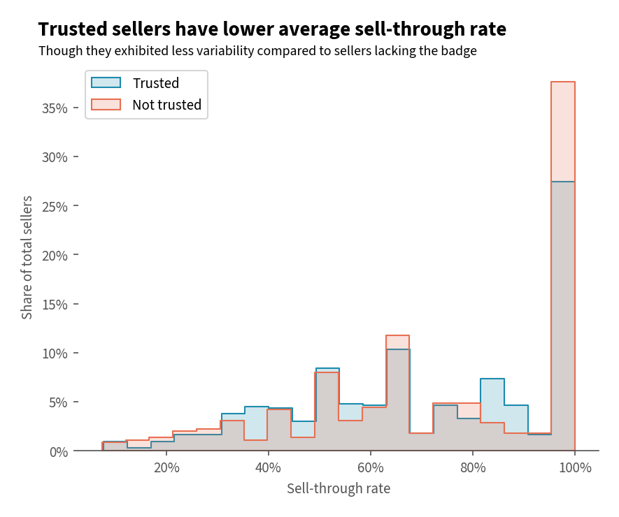

# C2C Fashion Resale Platform User Analysis

## Background

[Vestiaire Collective](https://www.vestiairecollective.com/), a Paris-based startup founded in 2009, is a resale platform that focuses on luxury fashion items. This analysis aims to provide insights into user behavior and deliver recommendations to improve retention rate and transaction experience.

## Summary

Analysis of over 98,000 user records found that while 16.3% of total users revisited the platform in the past year, retaining and converting inactive users proved to be challenging, with over 92% dropping out entirely. Negligible correlation between follows, likes and purchases (r=0.11, and r=0.14, respectively) suggest social features are unlikely to be primary drivers of purchases. Similarly, the lack of correlation between followers and sales for sellers (r=-0.05) further underscores the limited utility of the current implementation for transactional purposes. The high failure rate in seller onboarding, with over 54% of first-time sellers failing the vetting process, points to potential issues with listing guidelines. The 'trusted badge' system appears to have limited impact, as sell-through rates were virtually identical for badged and non-badged sellers, undermining its intended purpose of signifying trustworthiness. Looking ahead, prioritizing the building of users’ trust in authenticity and facilitating seamless transactions is essential for solidifying Vestiaire Collective's position as a designer brand-focused destination. Addressing the low pass rate through revised guidelines is a crucial step. Additionally, future investments should focus on enhancing quality control by expanding digital authentication capabilities and physical authentication hubs in high-volume regions to reduce processing cost.

## Insights

### Rentention

- 21.8% of users are considered ‘active’, i.e., have participated in at least one transaction, or have engaged in social features such as wishlisting and liking an item.
- Out of the 7.5% of users that have transacted on the platform, 3.5% of them are returning customers.
- Only 16.3% of users revisited the platform in the past year, highlighting challenges in retaining users’ interest.
- 47.3% of active users revisited in the past year, compared to 7.7% of inactive users. Most inactive users were not merely browsing without engaging with items; they appear to have dropped out entirely.

### Buyer Behavior

- Buyers represent 5.5% of total users and purchased 3.1 items on average throughout their average customer lifespan of 7.6 years.
    - 60.8% were one-time buyers, 15.6% purchased two items, and 23.6% made three or more purchases.
- Neither the number of accounts followed (r=0.11) nor items liked (r=0.14) were correlated to actual purchases. The number of wishlisted items, in contrast, has a slighty strong correlation (r=0.39).
    - Reasonable interpretations could be that buyers follow accounts sharing similar preferences just to get inspiration, or perhaps to keep tab on an item when cross-shopping by liking it.
    - Users might follow accounts or like items out of aspiration or to gauge the prices of desired items, but not necessarily what they are currently looking to purchase. Wishlisting, on the other hand, might imply a more deliberate purchase intent.

### Seller Behavior

- Sellers constitute 2% of the userbase and remained with the platform for slightly longer at 7.9 years. They were also considerably more active than buyers, listing 9.9 items and successfully selling 5.9 of those on average.
- 59.8% of the items listed end up getting sold, however, only 46.3% were deemed to match the seller's description.
    - At least 54.1%[1](#pass_rate) of sellers failed the vetting process during their first transaction. Futhermore, 16.6% of returning sellers failed the vetting process for every item they sold, suggesting a potential issue with the listing guidelines.
      
      
    - Western and Northern Europe, two subregions with high transaction volumes, have below-average pass rates.
      
        
- The number of followers has a moderate positive correlation with items sold (r=0.61) and items listed (r=0.52). Despite this, it does not translate to a higher likelihood of listings being sold (r=-0.05).
    - One way to see this is that sellers cultivate their brand to attract sales. However, given the listing photos are standardized, i.e. item on white background, no styling, it is more plausible that a history of successful sales is what primarily drives follower growth in this context.
    - The negligible correlation indicates that follower count doesn't significantly impact the likelihood of an individual item selling (sell-through rate).
- The strong positive correlation between items listed and sold (r=0.88) suggests that increased exposure through a higher volume of listings generally results in higher sales volumes. However, the negative correlation with sell-through rate (r=-0.25) points to possible diminishing returns in terms of sell-through efficiency.
    - This suggests that, when considering both the influence of followers and the volume of listings, there could be other factors at play—such as pricing strategy and seasonality, that are not fully captured here.
- Platform-wide, the sell-through rate for sellers with a trusted badge (those who sell regularly and have >80% pass rate)[2](#trusted) was nearly identical to that of sellers whose pass rate fell short of the minimum requirements, at 59.7% and 59.5%, respectively.
- At the user level, the sell-through rate for trusted sellers was 2.9% lower on average (70.6% vs. 73.5%), but exhibited less variability compared to sellers lacking the badge (standard deviation: 24.6% vs. 26%).
  
  

## Recommendation

### Addressing User Retention Challenges

- **Onboarding process improvements:** The onboarding flow should integrate an interactive step that lets user select the aesthetics or brands that resonates with them to collect preference data. This allows the initial feed to be immediately populated by relavent listings, increasing the likelihood of them discovering items of interest and reducing the feeling of a generic or overwhelming platform.
- **Targeted outreach:** Incentivize inactive users to return by providing discounted authentication fees or commissions through targeted email and app notifications.
- **Social media integrations:** Facilitating easy social media sharing of listings–whether to gather opinions on potential purchases or showcase recent acquisitions, allows the platform to leverage social validation. This peer influence can then drive both repeat engagement from current users and the organic acquisition of new ones.

### Improvements in Transaction Experience

- **Rollout price estimator for buyers:** Make the price estimator feature, currently used to provide guidance during the listing process, available on item listings. This provides prospective buyers a benchmark for the expected price range, reducing the need for haggling and enhancing transparency.
- **Listing guideline revisions:** The product fulfillment team should conduct an analysis to identify the primary reason for failing the vetting process. If discrepencies between the listed and actual condition are the main issue, the team could consider improving the clarity of listing guidelines pertaining to accecptable flaws.

### Improvements in Quality Control

- **Leverage brand partnership for authentication:** The listing process requires sellers to take prescribed photos for the AI to perform digital authentication. These photo requirements should align with brands' methods for identifying counterfeits by leveraging existing partnerships with brand partners. This alignment would ensure sellers provide the most relevant information and prevent illegitimate items from being listed.
- **Expand coverage of digital authentication program:** While direct shipping for items under €1000 offers user convenience and cost savings by foregoing physical authentication, its reliance on buyer disputes for nonconforming items presents a risk of significant costs in customer support and reimbursements. Investment in scaling the digital authentication program, which only screens select products at the moment, would offer a more proactive solution, alleviating the workload and reducing the incidence of nonconforming goods reaching buyers.
- **Staffing considerations for selected regions:** To mitigate the risk of nonconforming items reaching buyers from regions with high transaction volumes and below-average pass rates, consider increasing staffing at relevant authentication hubs to alleviate workload.

### Assumptions and Caveats

<ul>
    <li id="pass_rate">The minimum scenario includes only users with 0% pass rate. The maximum scenario, where 78.3% failed, assumes the worst case where users that do not have a perfect record all failed their first sale.</li>
    <li id="trusted">To earn the trusted badge, a seller must meet the following criteria over the past six months: sell at least two items, maintain a pass rate of 80% or higher, and ensure that at least 80% of sold items are shipped within five days. However, since these records are based on aggregated data that do not contain the time of each transaction, the number of trusted users may be overestimated due to the inclusion of non-regular sellers.
    </li>
    <li>The dataset includes only a subset of users, specifically those who joined within a 353-day window several years before the snapshot, as indicated by the <code>seniority</code> column. This limitation should be considered when extrapolating findings, as the behavior of newer users may differ from that of more senior ones.
    </li>
</ul>

---
- See SQL queries in the [SQL file](./Script/Exploration.sql).
- See analysis and visualization in the [Jupyter Notebook](./Script/Analysis_annotated.ipynb)
- See data source on [Kaggle](https://www.kaggle.com/datasets/jmmvutu/ecommerce-users-of-a-french-c2c-fashion-store?select=users.6M0xxK.2020.public.csv)